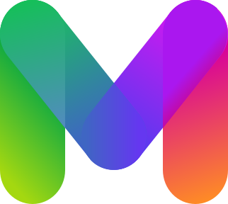

<p align="center">
  <a href="https://developers.mymoid.com" target="_blank" rel="noopener noreferrer">
   <picture>
      <source media="(prefers-color-scheme: dark)" srcset="./public/m.svg">
      
    </picture>
  </a>
</p>

# Mymoid Application Example with Next.js (App Router)

This repository provides an example implementation of the Mymoid API SDK in a Next.js application using App Router.

## Getting started

In the root directory, run the development server:

```bash
pnpm dev
```

Open [http://localhost:3000](http://localhost:3000) with your browser to see the result.

## Learn More

To learn more about Next.js, take a look at the following resources:

- [Next.js Documentation](https://nextjs.org/docs) - learn about Next.js features and API.
- [Learn Next.js](https://nextjs.org/learn/foundations/about-nextjs) - an interactive Next.js tutorial.
